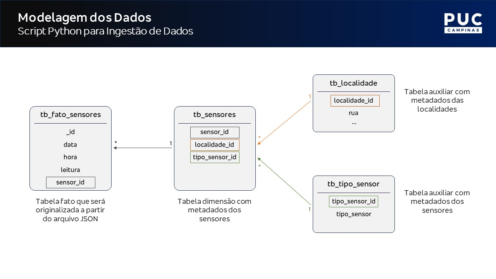

Esse é um mini projeto de Engenharia de Dados.

O conjunto de dados utilizado está disponível na pasta "Dados".

# Entendimento do Negócio

Uma fábrica de alimentos planeja implementar um projeto de dados para analisar informações de sensores IoT. 

Localizados em diversas áreas da fábrica, esses sensores enviam informações sobre a temperatura e a umidade específicas de cada zona. A proposta é utilizar esses dados para aprimorar tanto a eficiência quanto a qualidade dos alimentos fabricados, assegurando o cumprimento dos padrões estabelecidos.

Sendo assim, nosso principal objetivo é garantir que os dados estejam acessíveis à equipe de Analytics, possibilitando a realização das análises necessárias.

# Ciclo de Vida dos Dados

Os dados provenientes dos sensores IoT são disponibilizados todas as manhãs no formato JSON e armazenados em uma pasta no servidor local. Nesse arquivo temos informações sobre o código ID do sensor, o horário preciso da coleta e a medição correspondente (temperatura ou umidade).

Além disso, a fábrica disponibiliza algumas tabelas de metadados que são mantidas em um banco de dados relacional. Essas tabelas contém dados sobre os tipos de sensores e os locais onde estão instalados.

# Estratégia da Solução

Como estratégia para a solução do projeto, definimos as seguintes etapas:

- **1. Criação das tabelas "dimensão":** A elaboração das tabelas "dimensão" foi realizada de forma manual no SQL Server, dado o baixo volume de dados em movimento. O script correspondente encontra-se disponível na pasta "Metadados".

- **2. Carga do arquivo JSON:** nesta etapa, nosso script cria um banco de dados e uma coleção no MongoDB para realizar a carga do arquivo.

- **3. Tratamento dos dados:** na terceira etapa, implementamos as transformações necessárias nos dados para otimizar sua qualidade e coerência.

- **4. Disponibilização dos dados:** na etapa final, estabelecemos conexão com o SQL Server para criar e preencher uma tabela com os dados devidamente transformados.

# Arquitetura da Solução

Cada manhã, os sensores IoT geram um arquivo JSON, o qual é prontamente disponibilizado em uma pasta de um servidor local. O propósito central do script Python é efetuar o carregamento desse arquivo em sua forma bruta no MongoDB. Em seguida, são executadas as transformações necessárias nos dados, culminando na disponibilização estruturada dessas informações em uma tabela no SQL Server.

Os metadados são armazenados em tabelas específicas no SQL Server, sendo a finalidade principal a exposição dessa estrutura para a equipe de Analytics. Dessa maneira, possibilita-se a realização das análises necessárias com eficácia e precisão.

# Modelagem dos Dados

# Ferramentas Utilizadas

# Conclusões Finais

Esse mini projeto se desdobrou em quatro partes essenciais. Iniciamos com a criação das tabelas de dimensão e, posteriormente, automatizamos todo o processo por meio de um script Python. Desde a carga do arquivo JSON no MongoDB até a entrega dos dados de maneira estruturada no SQL Server. 

Como próximo passo, podemos considerar a implementação de um serviço de agendamento para a execução automática desse script em uma base diária. Dada a robustez do código desenvolvido, a implementação dessa automação não apresentaria desafios significativos, garantindo que os dados permaneçam constantemente atualizados e prontos para análises necessárias.

# Autor

Rafael Felippe  

